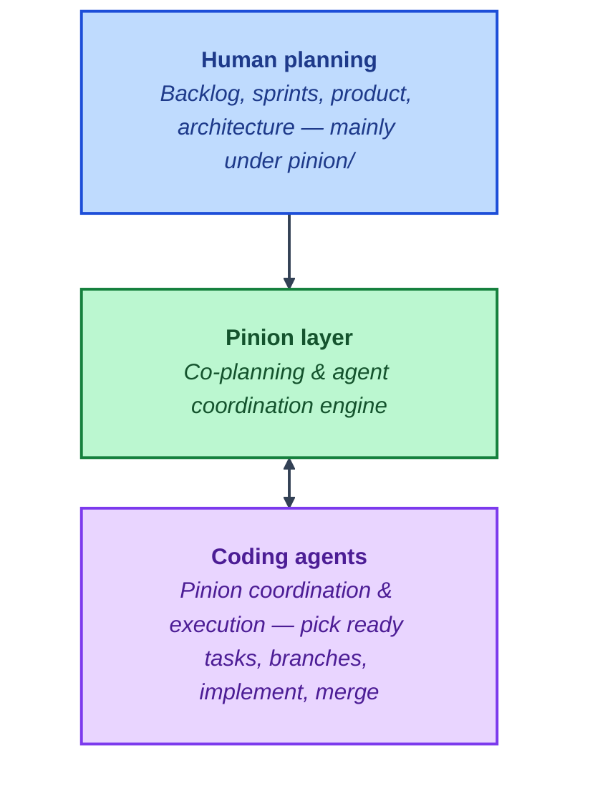

# FlowBoard

FlowBoard is a **demo through sprint-4**: kanban **workspaces** (structural), **boards**, **lists**, and **cards** with drag-and-drop (reorder cards inside a column, move cards between lists, reorder columns on the board), backed by **Prisma** + **SQLite** and a **Next.js** (App Router) UI and REST API. Sprint-4 focused on **UI polish** (typography, navigation context, due-date chips on cards, visible DnD error feedback, card-details keyboard/accessibility, loading skeleton for the board canvas); **auth, realtime, and Postgres are still out of scope** (see below and **[AGENTS.md](AGENTS.md)** for the client-only DnD boundary).

## Repository layout

- **Repository root** — FlowBoard app (`package.json`, `app/`, `lib/`, `prisma/`, `tests/`). Run **`npm install`**, **`npm run dev`**, **`npm test`**, and **`npm run build`** here.
- **`pinion/`** — Pinion coordination only (task graph, work units, generated views). It is **not** part of the shipped app. Contributors updating Pinion state should run **`cd pinion && ./bin/pinion build`** to refresh the graph and views; command details and agent-oriented notes live in **[pinion/AGENTS.md](pinion/AGENTS.md)**.

## Scope and limitations

This release is still **single-user** and **local-first**. **Workspaces are structural only** — they organize boards in the data model and API; there is **no login**, **no membership**, and **no permission enforcement**.

**Shipped in sprint-3 (UI + API):**

- **Workspace API** — `GET`/`POST` `/api/workspaces` and `GET /api/workspaces/[id]` (board summaries on detail, not nested lists/cards).
- **Board index (`/boards`)** — Choose a workspace (links + **`?workspaceId=`** in the URL), create workspaces, and create boards scoped to the selected workspace. Server actions pass **`workspaceId`** on create (falls back to the default workspace only when omitted).
- **Board page** — Edit **description** and **visibility** ( **`PATCH /api/boards/[boardId]`** ). Optional **Show archived cards** uses the same **`includeArchived`** query semantics as **`GET /api/boards/[boardId]`**. Cards support a **Details** panel for **description**, **due date**, and **archived** ( **`PATCH /api/cards/[cardId]`** ).
- **Column order** — **`POST /api/boards/[boardId]/lists/reorder`** with `{ "listIds": [ … ] }` (full permutation, dense positions). The UI uses the column **`⋮⋮`** handle.
- **Card order inside a column** — **`POST /api/lists/[listId]/cards/reorder`** with `{ "cardIds": [ … ] }` (full permutation, dense positions). The UI uses **`@dnd-kit/sortable`** (grip **`⋮⋮`** on each card) inside the same client-only board gate as other DnD (see **[AGENTS.md](AGENTS.md)**).
- **Cross-list card moves** — Still **`PATCH /api/cards/[cardId]`** with `listId` + `position` when dropping onto another column.

**Still not shipped (do not assume from this README):**

- **No authentication** — no OAuth, email/password, sessions, or per-user isolation. Anyone who can reach the app uses the same SQLite database.
- **No invites, roles, or workspace permissions** — the visibility field is stored for API/PRD alignment; it is **not** enforced for multiple users.
- **No realtime collaboration** — no websockets, presence, or coordinated concurrent edits.

**Deferred beyond sprint-3:** production auth, team/workspace membership, realtime updates, PostgreSQL as the default demo database, comments/labels/attachments at PRD scale, and other PRD items not listed above.

## Quick start (new contributors)

**Prerequisites:** Node.js (LTS recommended).

### Tests and production build

From the **repository root** (no `.env` required for this path):

```bash
npm install
npm run lint
npm test
npm run build
```

`npm test` runs migrations against `prisma/test-integration.db` (see `pretest` in `package.json`) and executes Vitest API tests. Test cleanup deletes in FK order: **cards → lists → boards → workspaces**. `npm run build` runs `prisma generate` and `next build`.

### Run the app locally

```bash
npm install
# Optional: copy .env.example → .env if you want an explicit DATABASE_URL file
npm run db:migrate
npm run dev
```

Open [http://localhost:3000](http://localhost:3000). Use **`/boards`** for the workspace-aware board index (optional **`?workspaceId=`**) and **`/boards/[id]`** for a board.

### Environment

- **`DATABASE_URL`** — Optional. If unset, the app defaults to `file:./prisma/dev.db` (see `lib/prisma.ts`). Use [`.env.example`](.env.example) as a template. For production, set `DATABASE_URL` in the host environment.

## Database (SQLite / Prisma)

FlowBoard uses **SQLite** via Prisma. An empty database is fine; migrations create tables.

```bash
npm run db:migrate       # prisma migrate deploy — safe on a fresh DB
npm run db:migrate:dev   # prisma migrate dev — when changing the schema
npm run db:smoke         # migrate + insert sample board/list/card (PIN-002 smoke)
```

Schema: **Workspace** → **Board** → **List** → **Card**, with **`position`** on lists and cards for ordering. Boards have **`description`** and **`visibility`**; cards have **`archived`** and optional **`dueDate`**.

## REST API (JSON)

Base path: **`/api`**. Errors use **`{ "error": "..." }`** with **4xx** where appropriate. JSON uses **camelCase** field names.

| Method | Path | Notes |
| --- | --- | --- |
| `GET` | `/api/workspaces` | `{ "workspaces": [ { id, name, createdAt } ] }` |
| `POST` | `/api/workspaces` | Body `{ "name"?: string }` — defaults name to `"Default"` if omitted/empty |
| `GET` | `/api/workspaces/[workspaceId]` | Workspace plus `boards` as board summaries (no nested lists) |
| `GET` | `/api/boards` | Optional query **`workspaceId`** — filter boards; omit to return all |
| `POST` | `/api/boards` | Body `{ "title", "workspaceId"? }` — unknown workspace **404** |
| `GET` | `/api/boards/[boardId]` | Nested lists → cards by `position`; optional **`includeArchived`** |
| `PATCH` | `/api/boards/[boardId]` | Body `{ "title"?, "description"?, "visibility"? }` |
| `DELETE` | `/api/boards/[boardId]` | Cascades lists and cards |
| `POST` | `/api/boards/[boardId]/lists/reorder` | Body `{ "listIds": string[] }` — every list on the board, exactly once |
| `POST` | `/api/lists/[listId]/cards/reorder` | Body `{ "cardIds": string[] }` — every card in the list, exactly once |
| `POST` | `/api/lists` | Body `{ "boardId", "title", "position"? }` |
| `PATCH` | `/api/lists/[listId]` | Body `{ "title"?, "position"? }` |
| `DELETE` | `/api/lists/[listId]` | |
| `POST` | `/api/cards` | Body `{ "listId", "title", "description"?, "position"? }` |
| `PATCH` | `/api/cards/[cardId]` | Body `{ "title"?, "description"?, "listId"?, "position"?, "archived"?, "dueDate"? }` — `dueDate` ISO string or **`null`** to clear; `listId` only within the **same board** |
| `DELETE` | `/api/cards/[cardId]` | |

Run **`npm test`** for automated API coverage (workspaces, scoped boards, board PATCH, cards archive/due date, list and **in-list card** reorder, and sprint-path regression).

## Learn more

- [Next.js documentation](https://nextjs.org/docs)
- [Prisma documentation](https://www.prisma.io/docs)

## Deploy

Deploy like any Next.js app (e.g. [Vercel](https://vercel.com/)); set **`DATABASE_URL`** to a database your host supports (this repo defaults to SQLite for local demo work).

## Pinion-Built

This demo repo is being built by [Level Up](https://levelupla.io)'s Pinion.

- Demo sprints: Four (and counting)
- Human code contributions to date: Zero

### About Pinion

**Pinion** is a repository-native coordination engine for planning and executing software work with humans and AI agents.
 
Built to be a reasoning layer between human planning and multiple code agents, it's repo-native and fast.

- **Drop-in** — Lives in `pinion/` (which is NOT committed to this demo repo); no external service required.  
- **Agent-friendly** — JSON and Markdown; agents read and transition via CLI, Skills, etc.  
- **Human-readable** — Product, backlog, sprints, and generated views live in the repo.

See Pinion in action:
- Video: [BacklogZero&#174; `pinion plan-sprint` demo](https://youtu.be/NFP9XZs9qbU)
- Video: [BacklogZero&#174; `pinion go` demo](https://youtu.be/vwtawusFMWk)
- Video: [BacklogZero&#174; `pinion retro` demo](https://youtu.be/BP8yQ6TpJ_4)

### Where Pinion sits in Level Up's own AI coding workflows

Humans own intent and sequencing; Pinion is the shared coordination layer; coding agents execute and feed results back.


More on Level Up x [Agentic AI](https://levelupla.io/category/ai-agents/).
