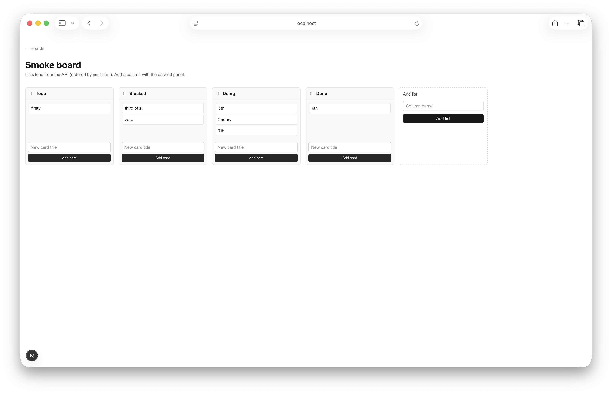

# Sprint 2

## 1. Sprint Goal

**Align persistence and public API with the PRD core hierarchy and board/card metadata** while keeping **no-auth / single-tenant** behavior: every board belongs to a workspace; boards and cards expose PRD-shaped fields that do not imply users or collaboration; list column order is consistent end-to-end (API + UI). Auth, realtime, and collaboration features stay **out of scope**.

## 2. In-Scope Chains

- **Data model** — `Workspace` in Prisma; required `workspaceId` on `Board` with default workspace backfill; board fields (`description`, `visibility`); card fields (`archived`, `dueDate`); reproducible migration on empty and existing SQLite DBs.
- **DTOs** — Extend `lib/serialize.ts` mappers and types; camelCase JSON consistent with sprint-1 APIs.
- **HTTP API** — Workspaces CRUD slice; `PATCH` boards; workspace-scoped `GET /api/boards`; extended `PATCH` cards; list/column reorder via batch or documented position updates.
- **UI** — Horizontal reorder of lists on the board page with `@dnd-kit`, calling the chosen API.
- **Quality** — Vitest API coverage for new paths and FK-safe test cleanup; README documents sprint-2 scope and limitations.

**Deferred (not this sprint)**

- OAuth/email auth, `User` table, invites, roles, permissions enforcement, activity log.
- Realtime, comments, labels, attachments, search, notifications.
- PostgreSQL production cutover, S3, external sync.

## 3. Deferred Work

- Full workspace **membership** and permission matrix (structural workspace only this sprint).
- Card/list features beyond archive/due date and column reorder as defined above.
- Production hardening, Jira/app sync beyond Pinion coordination.

## 4. Critical Path

`PIN-011` → `PIN-012` → `PIN-013` → `PIN-014` → `PIN-015` → `PIN-016` → `PIN-017` → `PIN-018`

Schema and backfill first; DTOs before new routes; board/card API before list reorder; API before column DnD UI; tests and README last.

## 5. Root Targets

- **PIN-011** — Prisma: `Workspace`, board FK and metadata, card archive/due date, migration + default workspace backfill.

## 6. Risks

- **Existing local DBs** — Backfill must run in migration; document `prisma migrate` for contributors.
- **Test cleanup** — `beforeEach` deletes in FK order after `Workspace` exists (cards → lists → boards → workspaces).
- **Scope creep** — “Workspace” can imply auth; this sprint is **structural only** (default workspace acceptable).
- **Column reorder** — Prefer batch or clear position rules to avoid gaps/races vs many unrelated PATCHes.

## 7. Owner-Class Summary

All eight targets use **`owner_class: default`** (matches `agents.owner_classes.allowed` in `.pinion/config.yaml`).

---

## Targets (reference)

| ID | Target (summary) | Depends on |
| --- | --- | --- |
| PIN-011 | Prisma: Workspace, Board.workspaceId + description/visibility, Card archived/dueDate; migrate + default workspace backfill | — |
| PIN-012 | Extend `lib/serialize.ts` DTOs/mappers for workspaces and new board/card fields | PIN-011 |
| PIN-013 | REST: workspaces list/create/detail under `app/api/workspaces` | PIN-012 |
| PIN-014 | `PATCH` board; workspace-scoped `GET /api/boards`; create board sets `workspaceId` | PIN-013 |
| PIN-015 | `PATCH` card: `archived`, `dueDate`; board GET behavior for archived cards documented | PIN-014 |
| PIN-016 | List/column reorder API (batch or documented position updates) | PIN-015 |
| PIN-017 | UI: horizontal `@dnd-kit` list reorder on board page | PIN-016 |
| PIN-018 | Vitest API cases + FK cleanup order; README sprint-2 limitations | PIN-017 |

## Retrospective

### Meta

- **Date / time**: 2026-03-22 (retro closed same day as last PIN merges)
- **PINs**: PIN-011 through PIN-018 (all **released**)
- **Scope**: sprint-2 wrap — workspace-shaped model and APIs, board/card metadata, column reorder API + UI, README and Vitest coverage

### What happened

We **met the sprint goal**: **Workspace** in Prisma with backfill; boards carry **workspaceId**, **description**, and **visibility**; **GET /api/boards** can filter by workspace and **PATCH** updates board fields; cards support **archived** and **dueDate** with **GET board** omitting archived cards unless **includeArchived**; **POST …/lists/reorder** assigns dense positions; the board UI adds **nested @dnd-kit** contexts (columns vs cards) and calls the reorder API with optimistic rollback on failure. **Vitest** covers the new API paths and FK-safe cleanup; the root **README** documents sprint-2 scope and explicit **no-auth / structural workspace** limits. All eight pins shipped in order; **`pinion retro`** closed **sprint-2** and cleared **`active_sprint`**.

After the sprint, a **hydration mismatch** on `/boards/[id]` was fixed by loading **`BoardListsView` client-only** via **`BoardListsGate`** (`next/dynamic` with **`ssr: false`** in a Client Component), because **@dnd-kit** output can diverge from SSR HTML.

### 5 whys

_Focus: Why did the board page show a React hydration error after column reorder shipped?_

1. **Why did hydration fail?** The server-rendered HTML for the column header did not match the client’s first paint (e.g. drag handle / attributes differed).
2. **Why was the markup different?** **`BoardListsView`** is a Client Component but was still **SSR-prerendered** with **@dnd-kit** hooks (`useDraggable`, nested **`DndContext`**), whose listeners and a11y attributes are not guaranteed to serialize identically to the browser tree.
3. **Why was DnD in SSR at all?** Next still **pre-renders** client components on the server for the initial HTML unless explicitly opted out.
4. **Why wasn’t it opted out during PIN-017?** The implementation focused on **correct API behavior and nested contexts** for card vs column drag; **hydration** as a production constraint surfaced only when exercising the full page in dev.
5. **Why?** (root cause) **Drag-and-drop libraries that attach synthetic listeners and dynamic ids** are a poor fit for **SSR snapshots**; the durable fix is **client-only mounting** (or a static shell that matches byte-for-byte) for the DnD subtree.

### Actions

- [ ] **README or AGENTS note** — Document that **board column DnD** is loaded **client-only** (`BoardListsGate`) so future changes do not re-enable SSR for `@dnd-kit` on this page.
- [ ] **Sprint-3 planning** — Set **`project.active_sprint`** when ready; candidates from the PRD still deferred: **auth**, **realtime**, **workspace membership**, or **Postgres** hardening—explicitly out of scope for sprint-2.

### Notes

**Delivered vs PRD:** Core hierarchy **Workspace → Board → List → Card** is reflected in persistence and APIs; **visibility** is stored but **not enforced** for multi-user access (matches “structural only” intent). **App-only follow-up:** commit **`fix(board): avoid DnD hydration mismatch`** on repo `main` adds **`BoardListsGate.tsx`** and updates **`page.tsx`**—not tied to a PIN id. **`pinion stats`** will continue to show **zero lines** for merges until Pinion’s git root aligns with the app tree or stats are collected another way.

### Sprint 2 End Board

