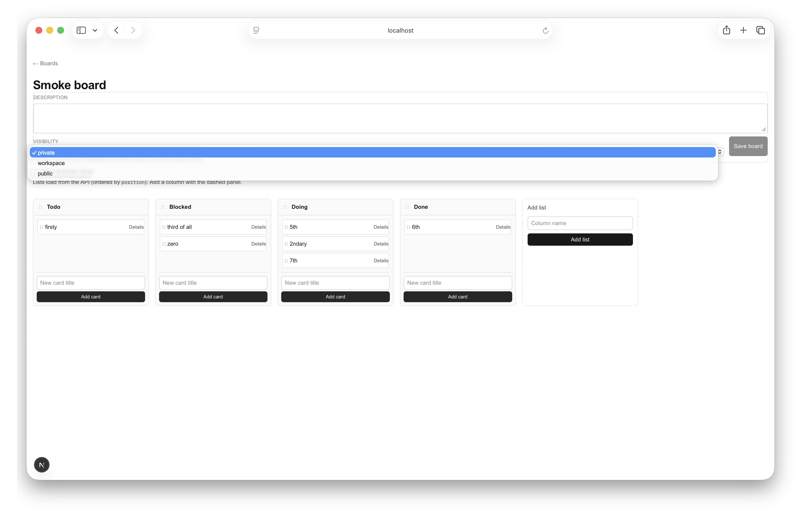

# Sprint 3: Basic features

## Sprint goal

Deliver **user-visible basics** that make sprint-2’s data model feel complete in the app: **board settings**, **richer cards** (description, due date, archive + optional “show archived”), **workspace-aware board listing**, and **drag to reorder cards inside a column**, while staying **no-auth / single-tenant** and **not** implementing membership, realtime, or production DB cutover.

## In-scope chains

1. **Documentation / conventions** — Record that board column DnD stays behind client-only loading (`BoardListsGate` / `next/dynamic` with `ssr: false`) so `@dnd-kit` is not server-rendered on `/boards/[boardId]`.
2. **Board surface** — UI for board description and visibility aligned with existing PATCH board API.
3. **Card surface** — Card detail/editing for description, due date, archive; fetch path supports `includeArchived` where needed.
4. **Workspace navigation** — Workspace-aware boards index and creation flows scoped to structural workspaces.
5. **Intra-list reorder** — New list cards reorder API plus UI integration with existing cross-list and column DnD.

## Deferred work

- OAuth/email auth, `User`, invites, roles, permission **enforcement**.
- Activity log, realtime, presence, websockets.
- PRD-scale comments (with `user_id`), attachments, notifications, search.
- PostgreSQL migration, S3, external sync, full workspace **membership**.

## Critical path

PIN-019 → PIN-020 → PIN-021 → PIN-022 → PIN-023 → PIN-024 → PIN-025

Documentation first (retro action), then board and card UI, then workspace listing, then reorder API, then intra-list DnD, then README and validation for sprint close.

## Root targets

- **PIN-019** — Document client-only `@dnd-kit` / `BoardListsGate` in AGENTS.md (and README only if needed).

## Risks

- **Hydration / SSR** — Reintroducing SSR for sortable surfaces can break Next.js hydration; doc + continued use of `BoardListsGate` mitigates.
- **DnD interaction matrix** — Intra-list reorder must coexist with cross-list moves and list column reorder without conflicting sensors or state.
- **Scope creep** — Auth, realtime, and membership stay explicitly out; visibility remains stored, not enforced.

## Owner-class summary

All sprint targets use **`default`** (matches `agents.owner_classes.allowed` in `.pinion/config.yaml`).

---

## Context from [sprint-2.md](sprint-2.md)

**Already shipped (sprint-2):** Structural `Workspace`, board `description` / `visibility`, card `archived` / `dueDate`, list reorder API + UI, Vitest + README boundaries, `[BoardListsGate](app/boards/[boardId]/BoardListsGate.tsx)` client-only mount to avoid `@dnd-kit` hydration issues.

**Still deferred by sprint-2 (unchanged for this sprint):** OAuth/email auth, `User`, invites, roles, permission **enforcement**, activity log, realtime, **comments/labels/attachments** (as full PRD features), search, notifications, PostgreSQL/S3/sync, full workspace **membership**.

**Sprint-2 retro action (completed this sprint):** [AGENTS.md](../../../AGENTS.md) at the FlowBoard repo root documents that board column DnD stays under **client-only** loading (`BoardListsGate` / `next/dynamic` `ssr: false`) so `@dnd-kit` is not server-rendered on `/boards/[boardId]`.

**Outcomes after sprint-3:** Board page exposes **description** and **visibility**; cards have a **Details** flow for **description**, **due date**, and **archived**; the board URL supports **show archived** via **`includeArchived`** on the server fetch; **`/boards`** is **workspace-aware** (`?workspaceId=`, create workspace, scoped board create); **`POST /api/lists/[listId]/cards/reorder`** exists with Vitest coverage; intra-list reorder uses **`@dnd-kit/sortable`** alongside existing cross-list and column DnD; [README.md](../../../README.md) describes sprint-3 scope and the new API route.

---

## Explicitly out of scope

- Authentication, users, invites, RBAC enforcement (visibility remains **stored**, not access-controlled).
- Realtime / websockets / presence.
- PRD-scale **comments** (with `user_id`), **attachments**, **notifications**, **search** — defer unless you later shrink another track.
- PostgreSQL migration, S3, external sync.

## Retrospective

### Meta

- **Date / time**: 2026-03-22
- **Scope**: sprint-3 wrap

### What happened

All seven targets (PIN-019–PIN-025) shipped: documentation for the board DnD gate, board settings in the UI, richer cards and archived visibility on the board page, workspace-scoped board listing, list card reorder API with tests, sortable intra-list drag-and-drop, and README aligned with sprint-3. The sprint stayed within **no-auth / single-tenant** boundaries; deferred items (membership enforcement, realtime, Postgres cutover, full PRD collaboration features) were not started.

### 5 whys

_Focus: a planning/tooling snag during sprint planning — extra placeholder work units appearing on `pinion build`._

1. **Why did `pinion build` sometimes create duplicate “Basic features” work units?** Because `sync_sprint_to_work_units` parsed the sprint markdown H1 and treated the subtitle after an em dash as a new target string that did not match existing JSON `target` text, so it kept minting new PINs.
2. **Why did that string not match?** The parser extracted a short title (“Basic features”) while hand-authored units used long, specific `target` sentences.
3. **Why does the engine parse headings at all?** To auto-provision work units from sprint docs without manually duplicating every PIN line.
4. **Why tie sync to heading shape?** To give planners a lightweight markdown-native way to declare stories (headings and conventions) alongside free-form body text.
5. **Why is that fragile?** **Root cause:** The sprint file is both human narrative and machine input; **title conventions are part of the contract**. Using an H1 pattern that collides with the extractor (e.g. `# Sprint N — Theme`) triggers false-positive targets unless the extracted string already exists as a work unit `target` or the title avoids that pattern.

### Actions

- [x] Use an H1 that does not trigger the ` — ` story extractor for spurious targets (e.g. `# Sprint 3: Basic features`), or keep explicit PIN JSON as the source of truth and avoid duplicate “umbrella” targets in headings.
- [ ] Decide whether this repository should **track `pinion/.pinion` in git** (or only selected files). Right now FlowBoard code merges on `main` while Pinion state may be local-only, so retro **line stats** stayed at zero even though the app changed materially; tracking state or recording stats at merge time would make retros match reality.
- [ ] Before the next sprint: set `project.active_sprint` in `.pinion/config.yaml`, run **`pinion plan-sprint`** (or hand-edit the graph), then **`pinion build`** so the frontier matches intent.

### Notes

**Follow-ups for later sprints:** authentication and real multi-user isolation; workspace **membership** and **enforced** visibility; realtime / presence; PostgreSQL (or other hosted DB) as the default for non-demo deploys; PRD-scale comments, attachments, search, and notifications.

**Technical note:** Intra-list reorder depends on **`@dnd-kit/sortable`**; keep sortable trees inside the same **client-only** boundary as **`BoardListsGate`** (see [AGENTS.md](../../../AGENTS.md)).

### Sprint 3 End Board

