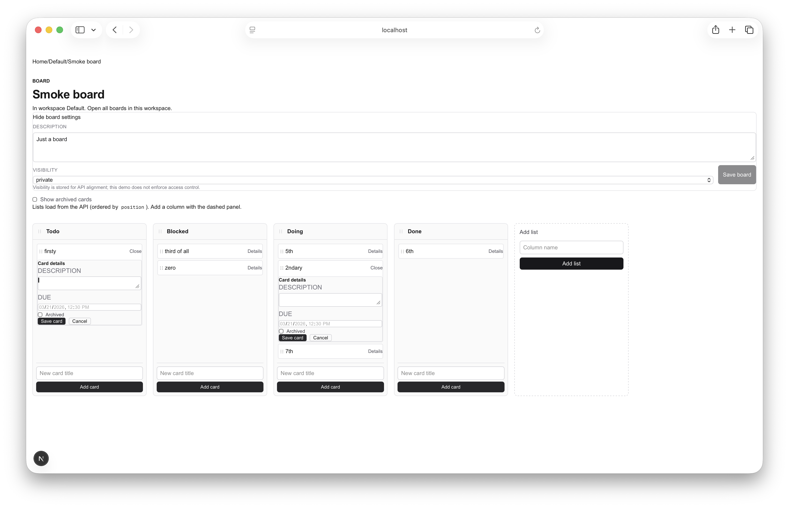

# name: Sprint 4 UI improvements
overview: "Plan Sprint 4 with theme **UI improvements**: polish global typography and chrome, strengthen navigation context on the board page, surface card metadata and failed-operation feedback in the client-only DnD tree, improve the card details experience for accessibility, and lightly enhance the boards index—while keeping sprint-3’s deferred backend-heavy work (auth, realtime, Postgres, PRD collaboration) explicitly out of scope."

# Sprint 4: UI improvements

## Grounding in sprint-3
**From [sprint-3.md](sprint-3.md) — deferred (unchanged; stay out of this sprint):** OAuth/email auth, `User`, invites, roles, **enforcement**, activity log, realtime/presence, PRD-scale comments/attachments/notifications/search, PostgreSQL/S3/sync, full workspace **membership**.

**From sprint-3 retrospective — process (optional parallel track, not “product UI”):** decide whether to **track `pinion/.pinion` in git**; before execution, set `**project.active_sprint**` in `[.pinion/config.yaml](pinion/.pinion/../.pinion/config.yaml)` (or repo-relative path under `pinion/`), run `**pinion plan-sprint**` / `**pinion build**` so the frontier matches intent; keep H1 as `**# Sprint 4: UI improvements**` (colon form) to avoid the `—` story-extractor pitfall documented in the retro.

**Already-shipped surfaces to improve (no new entities required):** `[app/layout.tsx](app/layout.tsx)` + `[app/globals.css](app/globals.css)`, `[app/page.tsx](app/page.tsx)`, `[app/boards/page.tsx](app/boards/page.tsx)`, `[app/boards/[boardId]/page.tsx](app/boards/[boardId]/page.tsx)`, `[BoardMetaEditor.tsx](app/boards/[boardId]/BoardMetaEditor.tsx)`, `[IncludeArchivedToggle.tsx](app/boards/[boardId]/IncludeArchivedToggle.tsx)`, `[BoardListsGate.tsx](app/boards/[boardId]/BoardListsGate.tsx)` (skeleton), and the large client tree `[BoardListsView.tsx](app/boards/[boardId]/BoardListsView.tsx)` (cards, columns, nested `DndContext`). **Constraint:** keep all `@dnd-kit` work inside the existing **client-only** boundary (`[BoardListsGate](app/boards/[boardId]/BoardListsGate.tsx)` / `ssr: false`) per [AGENTS.md](AGENTS.md).

---

## 1. Sprint goal

Make FlowBoard **feel more intentional and legible**: consistent typography, clearer **where you are** (workspace ↔ board), **at-a-glance** card signals (e.g. due dates), **honest feedback** when drag-and-drop API calls fail, and **better keyboard/modal semantics** for card details—without new auth, realtime, or schema features.

---

## 2. In-scope chains

| Chain | Targets | Intent |
| --- | --- | --- |
| **Global shell** | PIN-026 | Typography, spacing, and chrome on layout, globals, and landing. |
| **Boards index** | PIN-027 | Workspace-aware index polish aligned with the new visual system. |
| **Board context** | PIN-028 | Stronger workspace ↔ board navigation context in the board header. |
| **Card signals** | PIN-029 | Due (and related) metadata visible on cards inside `BoardListsView`. |
| **DnD honesty** | PIN-030 | User-visible errors and consistent rollback when reorder/move APIs fail. |
| **Card details a11y** | PIN-031 | Keyboard, focus, and ARIA for the card details experience alongside DnD. |
| **Loading polish** | PIN-032 | `BoardListsGate` skeleton closer to final layout to reduce shift. |
| **Sprint niceties** | PIN-033 | Empty-board hint, `IncludeArchivedToggle` label wiring, optional collapsible board meta. |
| **Regression guard** | PIN-034 | Tests extended for new UI/error/a11y behavior where practical. |
| **Docs** | PIN-035 | Brief developer note if patterns or boundaries change. |

---

## 3. Deferred work

Same explicit deferrals as sprint-3: authentication, multi-user isolation, permission enforcement, realtime, Postgres cutover, PRD comments/attachments/search/notifications, workspace membership semantics. No new tables or server-only DnD.

---

## 4. Critical path

PIN-026 → PIN-027 → PIN-028 → PIN-029 → PIN-030 → PIN-031 → PIN-032 → PIN-033 → PIN-034 → PIN-035

Foundation (global + index + header context) before column canvas work; card metadata before error handling and modal focus work; polish and tests/docs last.

---

## 5. Root targets

- **PIN-026** — Global typography and chrome (`layout.tsx`, `globals.css`, home) establishing the sprint-4 visual baseline.

---

## 6. Risks

| Risk | Mitigation |
| --- | --- |
| **Nested `DndContext` + dialog focus** | Test keyboard and pointer flows; prefer minimal ARIA and focus restore over heavy focus-trap libraries unless needed. |
| **SSR / hydration** | Do not mount expanded sortables from the server; any new overlays stay under `BoardListsGate`. |
| **Scope creep** | “UI improvements” does not mean new tables or comment threads; due chips and badges use existing fields only. |

---

## 7. Owner-class summary

All sprint-4 targets use **`owner_class: default`** (matches `.pinion/config.yaml` `agents.owner_classes.allowed`).

---

## Explicitly out of scope (same as sprint-3 deferrals)

Authentication, multi-user isolation, permission enforcement, realtime, Postgres cutover, PRD comments/attachments/search/notifications, workspace membership semantics.

---

## Optional (if capacity allows)

Covered as **PIN-033**: empty board hint, `IncludeArchivedToggle` `htmlFor` + id, collapsible `BoardMetaEditor` section.

## Retrospective

### Meta

- **Date / time**: 2026-03-22
- **Scope**: sprint-4 wrap

### What happened

All ten planned targets (**PIN-026**–**PIN-035**) shipped: global typography and theme tokens, boards index polish and loading UI, board header breadcrumbs and workspace fetch, card due chips and archived badges, a unified DnD error banner with rollback/refresh, card-details keyboard/ARIA and focus return, a column-shaped **BoardListsGate** skeleton, empty-board and settings niceties, **Vitest** coverage for **`cardDueMeta`** and reorder API **`error`** strings, and **AGENTS.md** / **README** updates for sprint-4 board conventions. Scope stayed UI-only; no auth, realtime, or schema expansion.

After sprint close, **BoardMetaEditor** showed a **hydration mismatch** in dev (server HTML still matched an older root `<form>` shape while the client rendered a wrapping `
` around an inner `<form>`). That was fixed by using a **single root `<form>`** again (toggle as `type="button"`) and **stable `id`s from `boardId`** instead of **`useId()`**.

_Separate issue: hydration — **Why** did the board page mismatch? **Client `BoardMetaEditor` markup changed** (wrapper `div` + nested `form`) while **SSR output could still reflect an earlier shape** or **first-paint structure diverged**; **root cause:** **not keeping the outer DOM tag stable** (`<form>` vs `
`) when iterating a **client component** that is still **pre-rendered on the server**.

### Notes

- **Good patterns to carry forward:** **`readApiErrorMessage`**, **`cardDueMeta`** in **`lib/`** with tests, **`BoardListsGate`** static skeleton only, **AGENTS.md** “Board UI conventions (sprint-4)” as the handoff for future DnD/UI work.
- **Next sprint candidates** (not committed here): labels or filters (still API-bound), board-level loading.tsx, or the deferred **auth/realtime** track once scope is explicitly opened.

### Sprint 4 End Board

