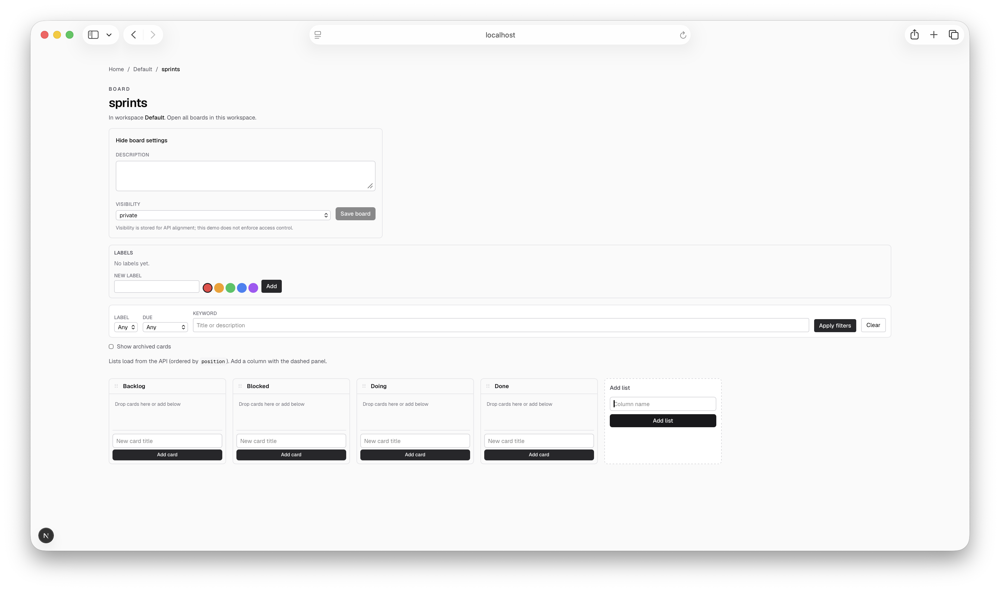

# name: Sprint 5 labels and filters
overview: "Plan Sprint 5 with theme **labels and filters**: add board-scoped labels and card assignment in Prisma + REST, expose filterable board reads (label / due / keyword), and surface chips plus thin filter UI in the existing client-only board tree—keeping auth, realtime, Postgres, and user-bound collaboration (comments, assignees) out of scope."

# Sprint 5: Labels and filters

## Grounding in sprint-4

**Shipped (sprint-4):** UI polish—theme tokens, boards index, workspace↔board header context, due chips / archived badges, DnD error banner with rollback/refresh, card-details a11y, column-shaped `BoardListsGate` skeleton, niceties, Vitest for `cardDueMeta` / reorder errors, and AGENTS.md board UI conventions.

**Deferred (unchanged; stay out of this sprint):** OAuth/email auth, `User`, invites, roles, enforcement, activity log, realtime/presence, PRD-scale comments/attachments/notifications/search, assignees, PostgreSQL/S3/sync, full workspace membership.

**Surfaces to extend:** Prisma `Card` / board APIs under `app/api/`, DTO mappers in `lib/serialize.ts`, board page + `[BoardListsView.tsx](app/boards/[boardId]/BoardListsView.tsx)` (label chips, assign UI, filter controls). **Constraint:** keep `@dnd-kit` and new board-canvas overlays inside `[BoardListsGate](app/boards/[boardId]/BoardListsGate.tsx)` / `ssr: false` per [AGENTS.md](AGENTS.md). Prefer stable outer DOM on any client component that still SSR (sprint-4 hydration lesson).

---

## 1. Sprint goal

Make cards **categorizeable and queryable**—board-scoped labels end-to-end (schema → API → thin UI) and **filter the board** by label, due window, and keyword—so humans and agents can slice work without auth or realtime.

---

## 2. In-scope chains

| Chain | Targets | Intent |
| --- | --- | --- |
| **Schema** | PIN-036 | Board-scoped `Label` + card↔label join; migration on SQLite. |
| **DTOs** | PIN-037 | Serialize labels on board/card payloads; camelCase JSON. |
| **Label API** | PIN-038 | CRUD labels for a board (`/api/boards/[boardId]/labels` or equivalent). |
| **Assign API** | PIN-039 | Attach / detach labels on a card. |
| **Filter reads** | PIN-040 | Board (or card) GET supports `label`, due, and keyword filters. |
| **Card chips** | PIN-041 | Label chips on card faces in `BoardListsView`. |
| **Manage / assign UI** | PIN-042 | Create/rename/delete labels; assign from card details (or compact board chrome). |
| **Filter UI** | PIN-043 | Board filter controls wired to filtered fetch / URL params. |
| **Regression guard** | PIN-044 | Vitest for label CRUD, assign, and filter semantics. |
| **Docs** | PIN-045 | README (+ AGENTS only if board UI conventions change). |

---

## 3. Deferred work

Same as prior sprints: authentication, multi-user isolation, permission enforcement, realtime, Postgres cutover, comments/attachments/notifications/assignees/search-as-product, workspace membership. No full-text search engine; keyword filter is simple string match on title/description.

---

## 4. Critical path

PIN-036 → PIN-037 → PIN-038 → PIN-039 → PIN-040 → PIN-041 → PIN-042 → PIN-043 → PIN-044 → PIN-045

Schema and DTOs before HTTP; label CRUD before assign; assign + filter reads before UI; chips before manage/filter chrome; tests and docs last.

---

## 5. Root targets

- **PIN-036** — Prisma: board-scoped labels and card↔label relation, with a reproducible SQLite migration.

---

## 6. Risks

| Risk | Mitigation |
| --- | --- |
| **Scope creep into “search product”** | Keyword = substring on existing card fields only; no indexer, no assignee filters. |
| **DnD + new controls** | Filters and label pickers stay outside sortable item internals where possible; still under `BoardListsGate`. |
| **Filter vs archive** | Compose with existing `includeArchived`; document query param matrix in README / tests. |
| **Color / theme bikeshed** | Ship a small fixed palette (or optional hex) with sensible defaults; no design-system rewrite. |

---

## 7. Owner-class summary

All sprint-5 targets use **`owner_class: default`**.

---

## Explicitly out of scope

Authentication, multi-user isolation, permission enforcement, realtime, Postgres cutover, comments, attachments, notifications, assignees, PRD-scale search, workspace membership semantics.

---

## Optional (if capacity allows)

Board-level `loading.tsx` polish; label color presets in the filter bar; empty-state copy when filters match no cards.

---

## Targets (reference)

| ID | Target (summary) | Depends on |
| --- | --- | --- |
| PIN-036 | Prisma Label + CardLabel; SQLite migration | — |
| PIN-037 | Serialize DTOs include labels | PIN-036 |
| PIN-038 | REST CRUD `/api/boards/[boardId]/labels` | PIN-037 |
| PIN-039 | Attach/detach labels on cards | PIN-038 |
| PIN-040 | GET board filter: label, due, keyword | PIN-039 |
| PIN-041 | Label chips on cards in BoardListsView | PIN-040 |
| PIN-042 | Manage labels + assign in card details | PIN-041 |
| PIN-043 | Board filter UI + URL params | PIN-042 |
| PIN-044 | Vitest for labels + filters | PIN-043 |
| PIN-045 | README sprint-5 scope and APIs | PIN-044 |

## Retrospective

### Meta

- **Date / time**: 2026-09-08
- **Scope**: sprint-5 wrap

### Stats

- **PB-1 artifact bundle:** `pinion/sprints/artifacts/sprint-5/` (under the Pinion tree)

- **Lines added** (sum): 1554
- **Net lines** (sum): 1516
- **Estimated input tokens** (sum): 1506
- **Files changed** (sprint envelope): 19

### What happened

All ten planned targets (**PIN-036**–**PIN-045**) shipped: board-scoped **Label** / **CardLabel** schema and migration, label DTOs, label CRUD and card attach/detach APIs, **GET** board filters (`label` / `due` / `keyword` with `includeArchived`), label chips on cards, board Labels manager + Details assign UI, URL-synced filter controls, Vitest coverage, and README / AGENTS updates. Scope stayed **no-auth / no-realtime**; labels unlock agent-friendly categorization and query without a search product.

### 5 whys

_Focus: Why did a FlowBoard type error (`cardDueMeta` arity / `readApiErrorMessage` fallback) and a Vitest import miss reach `main` during sprint execution?_

1. **Why did bad app code land on `main`?** Feature branches merged after `pinion transition … review|merged|released` succeeded.
2. **Why did those transitions succeed?** The Pinion proof gate runs **`pytest`** under `pinion/tests/` only—it does **not** run FlowBoard **`npm test`** or **`npm run build`**.
3. **Why is that the gate?** Pinion’s coordination repo is Python-first; the FlowBoard app lives at the workspace root as a sibling demo, so the default proof surface is Pinion’s own suite.
4. **Why did executors still miss it on some PINs?** App proof (`npm test` / `npm run build`) was run for many PINs but not enforced at every review boundary; a few merges relied on the Pinion gate alone after earlier green checks.
5. **Why?** **Root cause:** **Split-repo proof** — work-unit `validation` names app commands, but **transition tooling does not execute them**; without an explicit executor habit (or a wrapper gate) to run root Vitest/Next before review, TypeScript and Vitest failures can lag merges.

### Actions

- [ ] Before `pinion transition … review` on FlowBoard PINs: always run **`npm test`** and **`npm run build`** from the repository root (treat as hard proof even when Pinion pytest already passes).
- [ ] Optionally document this dual-gate in root **AGENTS.md** under board/app proof conventions.
- [ ] Next sprint candidates: thin **activity/history** (still no User), board **`loading.tsx`**, or an explicit **auth + agent token** track if multi-user demo scope opens.

### Notes

- **Good patterns to carry forward:** API-first labels before UI; **`lib/board-filters.ts`** + Vitest; filter/query params shareable for agents; keep filter chrome outside `@dnd-kit` internals; FK cleanup order includes **`cardLabel` → `label`**.
- Blog post: **[docs/sprint-5-labels-and-filters.md](docs/sprint-5-labels-and-filters.md)**.

### Sprint 5 End Board

