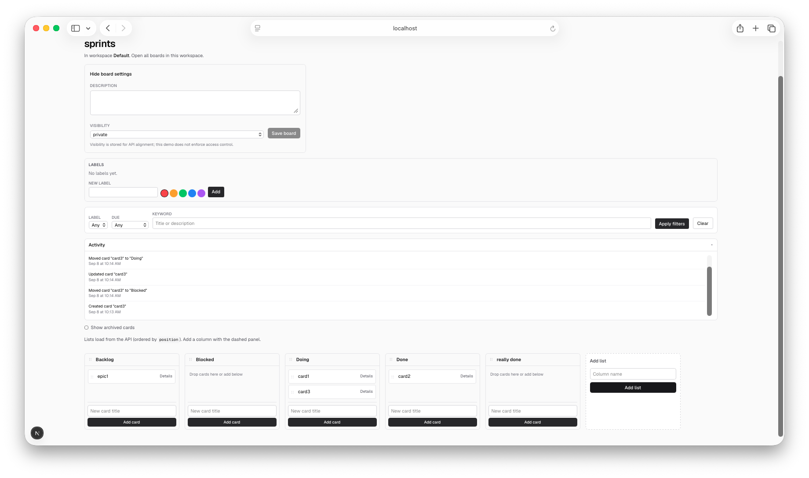

# name: Sprint 7 board activity log
overview: "Plan Sprint 7 with theme **board activity log**: add append-only activity entries on boards in Prisma + REST (typed events, optional actor string, no User), emit from high-signal mutation routes, expose GET with limit/cursor, and surface a thin Activity panel on the board page—keeping auth, realtime, Postgres, notifications, and full PRD activity filtering out of scope."

# Sprint 7: Board activity log

## Grounding in sprint-6

**Shipped (sprint-6):** Append-only **`Comment`** on **`Card`**, comment DTOs, **GET**/**POST** (and **DELETE**) `/api/cards/[cardId]/comments`, Details-panel list + compose (fetch on open), Vitest coverage, README API table, and **AGENTS.md** dual app proof gate + comment/Details conventions.

**Deferred (unchanged; stay out of this sprint):** OAuth/email auth, `User`, invites, roles, enforcement, realtime/presence, PRD-scale attachments/notifications/search, assignees, PostgreSQL/S3/sync, full workspace membership, comment mentions/editing/threading, rich activity search/filter UI.

**Surfaces to extend:** Prisma **`Board`** under `prisma/schema.prisma`, DTO mappers in `lib/serialize.ts`, a shared **`lib/record-activity.ts`** (or equivalent) called from existing mutation routes under `app/api/`, new **`GET /api/boards/[boardId]/activity`**, and a thin **Activity** panel on the board page (client fetch; keep under or beside **`BoardListsGate`** per [AGENTS.md](AGENTS.md)—no `@dnd-kit` coupling).

**Process carry-forward (sprint-6 retro):** Before `pinion transition … review` on FlowBoard PINs, always run **`npm test`** and **`npm run build`** from the repository root. Optionally document Pinion pytest with **`pinion/.venv/bin` on `PATH`** in **pinion/AGENTS.md** if capacity allows.

---

## 1. Sprint goal

Make board mutations **observable by humans and agents**—append-only activity entries end-to-end (schema → write-on-mutate → read API → thin UI) with optional **`actor`** string and no login—so automation can verify “what changed since my last run” without diffing full board JSON or opening every card’s Details panel.

---

## 2. In-scope chains

| Chain | Targets | Intent |
| --- | --- | --- |
| **Schema** | PIN-052 | `ActivityEntry` on `Board` (`type`, `summary`, optional `actor`, optional `cardId`, `metadata` JSON string or nullable fields, `createdAt`); SQLite migration. |
| **DTOs** | PIN-053 | `ActivityEntryDTO`; camelCase JSON; stable sort (newest first for feed). |
| **Write path** | PIN-054 | Shared recorder; emit from high-signal routes (see §5). Failures to record must not break mutations. |
| **Read API** | PIN-055 | `GET /api/boards/[boardId]/activity` with `limit` (default cap) and optional `cursor` / `before` for pagination. |
| **Activity UI** | PIN-056 | Collapsible Activity panel on board page; fetch on expand; human-readable lines from `summary` + timestamp. |
| **Regression guard** | PIN-057 | Vitest: entries written on mutate, list ordering, pagination edges, 404/400. |
| **Docs** | PIN-058 | README API table + event-type matrix; AGENTS activity conventions if needed. |

---

## 3. Deferred work

Same as prior sprints: authentication, multi-user isolation, permission enforcement, realtime, Postgres cutover, attachments, notifications, assignees, PRD-scale search, workspace membership. No activity **edit/delete**, no per-user read ACLs, no websocket push, no full-text activity search, no column/list reorder events in v1 unless trivial to add after card/label/comment coverage.

---

## 4. Critical path

PIN-052 → PIN-053 → PIN-054 → PIN-055 → PIN-056 → PIN-057 → PIN-058

Schema and DTOs before write path; recorder wired before read API; read API before UI; tests and docs last.

---

## 5. Root targets

- **PIN-052** — Prisma: `ActivityEntry` model on `Board`, with a reproducible SQLite migration.

**PIN-054 event coverage (minimum):**

| Event `type` | Emit from | Example `summary` |
| --- | --- | --- |
| `card.created` | `POST /api/cards` | `Created card "Fix login"` |
| `card.updated` | `PATCH /api/cards/[cardId]` | `Updated card "Fix login"` (title/description/due/archive) |
| `card.moved` | card PATCH (`listId`) or reorder routes | `Moved card "Fix login" to "In Progress"` |
| `label.attached` | `PUT/POST` card label attach | `Added label "Blocked" to "Fix login"` |
| `label.detached` | `DELETE` card label | `Removed label "Blocked" from "Fix login"` |
| `comment.created` | `POST /api/cards/[cardId]/comments` | `Comment on "Fix login": Deploy blocked…` (truncate long text) |

Optional **`actor`**: pass through from request body where routes already accept optional author-like fields; otherwise `null`. No new auth headers in this sprint.

---

## 6. Risks

| Risk | Mitigation |
| --- | --- |
| **Scope creep into audit product** | Append-only feed; fixed event types; no search UI or retention policies. |
| **Board GET payload bloat** | Do **not** nest activity on `GET /api/boards/[boardId]`; dedicated activity GET only. |
| **Recorder breaks mutations** | Wrap `recordActivity` in try/catch; log server-side; mutation response still succeeds. |
| **Duplicate entries on retries** | Accept at-most-once semantics for demo; document that idempotency is out of scope. |
| **Split-repo proof** | PIN-058 restates root **`npm test`** + **`npm run build`** before FlowBoard review transitions. |

---

## 7. Owner-class summary

All sprint-7 targets use **`owner_class: default`**.

---

## Explicitly out of scope

Authentication, multi-user isolation, permission enforcement, realtime, Postgres cutover, activity edit/delete, attachments, notifications, assignees, PRD-scale search, workspace membership semantics, list/column reorder activity (unless added as optional stretch), label CRUD activity events.

---

## Optional (if capacity allows)

Comment count badge on card face (sprint-6 optional); Pinion venv-on-`PATH` note in **pinion/AGENTS.md**; emit `label.created` / `list.created` for fuller PRD §10 parity.

---

## Targets (reference)

| ID | Target (summary) | Depends on |
| --- | --- | --- |
| PIN-052 | Prisma ActivityEntry on Board; SQLite migration | — |
| PIN-053 | Serialize ActivityEntry DTOs | PIN-052 |
| PIN-054 | Shared recorder + emit from mutation routes | PIN-053 |
| PIN-055 | REST GET `/api/boards/[boardId]/activity` | PIN-054 |
| PIN-056 | Activity panel UI on board page | PIN-055 |
| PIN-057 | Vitest for activity write + read | PIN-056 |
| PIN-058 | README + AGENTS activity conventions | PIN-057 |

## Retrospective

### Meta

- **Date / time**: 2026-09-08
- **Scope**: sprint-7 wrap

### Stats

- **Lines added** (sum): 730
- **Net lines** (sum): 720
- **Estimated input tokens** (sum): 1256
- **Files changed** (sprint envelope): 15

| id | lines added | net lines | est. input tok. | recorded_at |
| --- | --- | --- | --- | --- |
| PIN-058 | 25 | 19 | 173 | 2026-09-08T17:13:01Z |
| PIN-057 | 140 | 140 | 135 | 2026-09-08T17:12:10Z |
| PIN-056 | 107 | 107 | 187 | 2026-09-08T17:11:32Z |
| PIN-055 | 155 | 155 | 176 | 2026-09-08T17:10:48Z |
| PIN-054 | 172 | 168 | 246 | 2026-09-08T17:10:07Z |
| PIN-053 | 99 | 99 | 151 | 2026-09-08T17:09:13Z |
| PIN-052 | 32 | 32 | 188 | 2026-09-08T17:08:29Z |

### What happened

All seven planned targets (**PIN-052**–**PIN-058**) shipped: **`ActivityEntry`** schema and migration, activity DTOs, **`recordActivity`** wired into card/label/comment mutation routes (try/catch so writes never fail), **GET** `/api/boards/[boardId]/activity` with limit/cursor pagination, collapsible **Activity** panel (fetch on expand), Vitest coverage (41 tests), and README / **AGENTS.md** updates including event-type matrix. Scope stayed **no-auth / no-realtime**; agents can now verify board mutations without diffing full board JSON.

### 5 whys

_Focus: Why is activity recording fire-and-forget in route handlers instead of a guaranteed event pipeline?_

1. **Why record in route handlers?** The sprint chain required a write path (**PIN-054**) before the read API; mutation routes are where card/label/comment changes already happen.
2. **Why try/catch instead of failing the mutation?** Sprint risk: recorder must not break primary writes—agents care more about the card move succeeding than the audit row.
3. **Why not Prisma middleware or DB triggers?** Human-readable **`summary`** strings need card titles, list names, and label names at write time—middleware would re-fetch context or lose readable copy.
4. **Why not an async queue or outbox?** Demo scope has no job runner, no realtime, no delivery guarantees product—adding one is a different sprint.
5. **Why?** **Root cause:** **Demo-grade observability** — synchronous append-on-mutate with best-effort delivery is the smallest path that closes the agent **act → verify** loop; idempotency and guaranteed audit are explicitly deferred.

### Actions

- [x] Ship **board activity log** without `User` (**PIN-052**–**PIN-058**; closes sprint-6 retro candidate).
- [ ] Document (or automate) Pinion transitions with **`pinion/.venv/bin` on `PATH`** (carry-forward from sprint-6; **`released`** still failed once without venv during this sprint).
- [ ] Next sprint candidates: **auth + agent token**, comment count on card face, or **`label.created` / list reorder** activity events for fuller PRD §10 parity.

### Notes

- **Good patterns to carry forward:** dedicated activity GET keeps board GET lean; **fetch on panel expand** mirrors comments-in-Details; **`recordActivity`** try/catch; **`toActivityEntryDTOs`** newest-first; FK cleanup **`activityEntry → comment → …`**; seven-PIN sprint matched sprint-6 sizing.
- Blog post: **[docs/sprint-7-board-activity-log.md](docs/sprint-7-board-activity-log.md)**.

### Sprint 7 End Board

